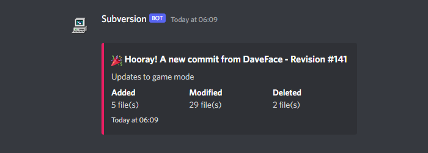

# Cheeky Discord SVN Hook(s)

Ok, it's just one hook really. This cheeky little script reacts to a Subversion post-commit action, and sends a nice looking webhook to Discord.

It looks a little something like this:

*FYI: The webhook username / icon is set in your Discord server, not the script.*

## Installing

- This has only been tested on a Linux server (Ubuntu, specifically) running vanilla Apache Subversion
- It uses Python, and has been tested on Python 3.8 and 3.10

### 1 - Set up the Discord Bot

1. On the Discord channel you want to post updates to, go to **Edit Channel > Integrations > Webhooks**, and then click **New Webhook**
2. Set the Icon and Name to whatever you want - the script doesn't interfere with these
3. Click **Copy Webhook URL**

### 2 - Configure the Script

Open the `post-commit` file in an editor, Notepad will do if you have no shame. This is the file without a `.py` extension - it's a Bash script that Subversion will call first.

- Change `WEBHOOK=` to your Discord Webhook URL
- Change `REPO=` to your repository path, e.g. `/svn/Your-Repo-Name`, no slash at the end!

### 3 - Install it

1. Copy the scripts into `/svn/Your-Repo-Name/hooks`
2. Navigate to `/svn/Your-Repo-Name/hooks` and run the following commands:
   1. `chmod a+x post-commit`
   2. `chmod a+x post-commit.py`
3. Test the script with the command `.\post-commit "blah" 69`, or some other revision number you know exists

## Troubleshooting

If the script doesn't run, it's probably one of these issues:

- Insufficent permissions on the script, try the following commands:
  - `chown www-data:www-data post-commit`
  - `chown www-data:www-data post-commit.py`
- A path is set incorrectly
  - The PYTHON and SVNLOOK paths should be broadly applicable, but double check that these are correct
  - Double check the Webhook URL. Then check it again. I am speaking from experience: I spent about 30 minutes troubleshooting a missing character on the end of my URL.
